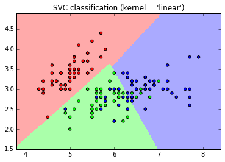

# Workshop 9/12

#### Explore the effects for different K in K Nearest Neighbor classification.
K = 5                      |  K = 10 
:-------------------------:|:-------------------------:
             |  

K = 15                     |  K = 25 
:-------------------------:|:-------------------------:
            |  

#### How we should choose K in K Nearest Neighbor Classification:

Choice of K is somewhat driven by the end application as well as the dataset. One can use KF Cross Validation for testing performance of KNN with some various quantities of neighbours and finding the optimum `k`. I do think we should choose `k` large enough that noise in the data is minimized and small enough so the samples of the other classes are not included. 

#### Explore different kernels of Support Vector Machine.

Linear                     |  Polynomial
:-------------------------:|:-------------------------:
        |  

Sigmoid                    |  RBF
:-------------------------:|:-------------------------:
        |  

#### How we should choose the kernel for Support Vector Machine:

Given an arbitrary dataset, starting with the simplest hypothesis space first -- the linear kernel -- which works fine if your dataset if linearly separable. Regardless of the results that are achieved similar from all the kernels, the complexity of the latter grows with the size of the training set. Use linear SVMs for linear problems, and nonlinear kernels such as the Radial Basis Function/Polynomial/Sigmoid kernel for non-linear problems. 

